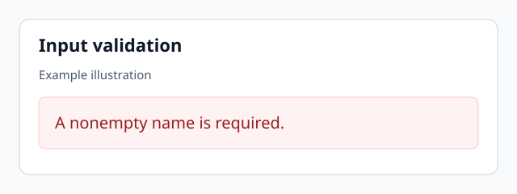

## Input validation

The [input check](examples/demo.js:3-5) rejects an empty name. This illustration shows the expected message:

The image path starts at this Markdown file's directory. The code reference starts at the Git repository root.
